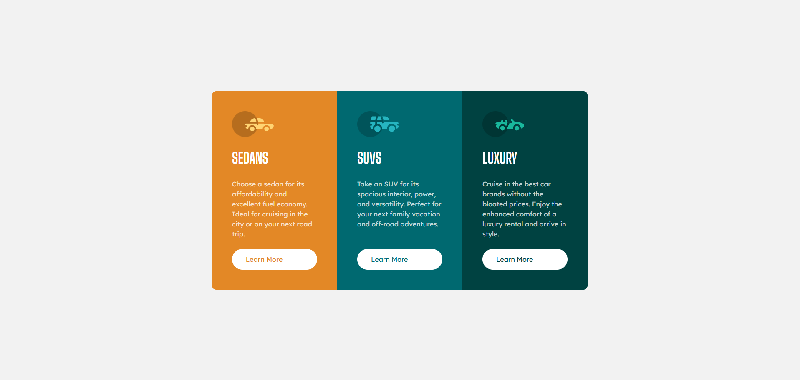

## Table of contents

- [Overview](#overview)
  - [The challenge](#the-challenge)
  - [Screenshot](#screenshot)
  - [Links](#links)
  - [Built with](#built-with)
  - [AI Collaboration](#ai-collaboration)
  - [Author](#author)

## Overview

A responsive 3-column preview card component built as part of a Frontend Mentor challenge. The component showcases three vehicle categories — Sedans, SUVs, and Luxury — each with its own themed card, description, and call-to-action button. On mobile, the cards stack vertically; on wider screens they align side by side.

### The challenge

Users should be able to:

- View the optimal layout depending on their device's screen size
- See hover states for interactive elements

### Screenshot

### Links

- Solution URL: [Repository](https://github.com/joaogllm/frontend-mentor-tests/tree/main/3-column-preview-card-component-main)
- Live Site URL: [Live](https://joaogllm.github.io/frontend-mentor-tests/3-column-preview-card-component-main/)

### Built with

- Semantic HTML5 markup (BEM methodology)
- CSS custom properties
- Flexbox
- Mobile-first workflow
- [Big Shoulders Display](https://fonts.google.com/specimen/Big+Shoulders+Display) & [Lexend Deca](https://fonts.google.com/specimen/Lexend+Deca) via Google Fonts

### AI Collaboration

This project was built with the assistance of Claude (Anthropic) as a learning tool. AI was used to:

- Review and improve the HTML structure for semantic correctness and accessibility
- Provide a CSS reset as a starting point
- Perform a full code review of the final solution, identifying issues such as missing `flex: 1` on cards, incomplete hover transitions, and debug styles left in production CSS

All code was written and understood by me — Claude was used as a reviewer and mentor, not a code generator.

## Author

- Instagram - [Joao Martins](https://www.instagram.com/joaogllm/)
- Frontend Mentor - [@joaogllm](https://www.frontendmentor.io/profile/joaogllm)
- Github - [@joaogllm](https://github.com/joaogllm)
