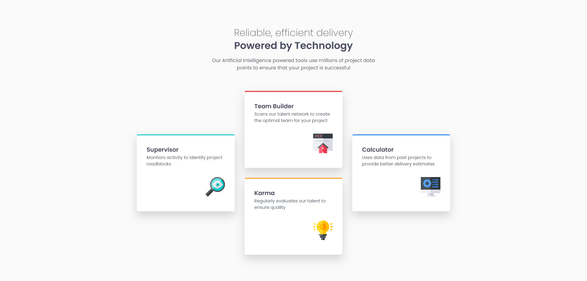

# Frontend Mentor - Four Card Feature Section

## Table of contents

- [Overview](#overview)
  - [The challenge](#the-challenge)
  - [Screenshot](#screenshot)
  - [Links](#links)
  - [Built with](#built-with)
  - [AI Collaboration](#ai-collaboration)
  - [Author](#author)

## Overview

This is a solution to the [Four Card Feature Section challenge on Frontend Mentor](https://www.frontendmentor.io/challenges/four-card-feature-section-weK1eFYK). The goal was to build a responsive feature section that closely matches the provided design, showcasing four cards with distinct accent colors that adapt from a single-column stacked mobile layout to a three-column CSS Grid desktop layout.

### The challenge

Users should be able to:

- View the optimal layout for the site depending on their device's screen size

### Screenshot

### Links

- Solution URL: [Repository](https://github.com/joaogllm/frontend-mentor-tests/tree/main/four-card-feature-section-master)
- Live Site URL: [Live](https://joaogllm.github.io/frontend-mentor-tests/four-card-feature-section-master/)

### Built with

- Semantic HTML5 markup
- CSS custom properties
- Flexbox
- CSS Grid
- Mobile-first workflow
- [Poppins](https://fonts.google.com/specimen/Poppins) - Google Fonts

### AI Collaboration

This project was built with AI assistance from [Claude (Anthropic)](https://claude.ai). Claude was used as a learning companion throughout the development process — reviewing code quality, suggesting semantic HTML improvements, clarifying CSS Grid placement, and providing feedback on BEM naming conventions and accessibility best practices. All code was written and understood by the author; AI served as a mentor rather than a code generator.

## Author

- Instagram - [Joao Martins](https://www.instagram.com/joaogllm/)
- Frontend Mentor - [@joaogllm](https://www.frontendmentor.io/profile/joaogllm)
- Github - [@joaogllm](https://github.com/joaogllm)
