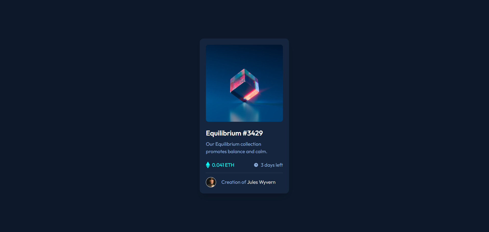

# Frontend Mentor - NFT Preview Card Component

## Table of contents

- [Overview](#overview)
  - [The challenge](#the-challenge)
  - [Screenshot](#screenshot)
  - [Links](#links)
  - [Built with](#built-with)
  - [AI Collaboration](#ai-collaboration)
  - [Author](#author)

## Overview

This is my solution to the [NFT Preview Card Component challenge](https://www.frontendmentor.io/challenges/nft-preview-card-component-SbdUL_w0U) on Frontend Mentor. The goal was to build a responsive NFT card component as close to the provided design as possible, including hover interactions.

### The challenge

Users should be able to:

- View the optimal layout depending on their device's screen size
- See hover states for interactive elements — including a cyan overlay with an eye icon on the NFT image, a color change on the card title, and a highlight on the creator's name

### Screenshot

### Links

- Solution URL: [Repository](https://github.com/joaogllm/frontend-mentor-tests/tree/main/nft-preview-card-component-main)
- Live Site URL: [Live](https://joaogllm.github.io/frontend-mentor-tests/nft-preview-card-component-main/)

### Built with

- Semantic HTML5 (`<article>`, `<main>`)
- CSS custom properties (design tokens for colors)
- Flexbox for layout
- Mobile-first workflow
- CSS transitions for hover interactions
- [Outfit](https://fonts.google.com/specimen/Outfit) — Google Fonts

### AI Collaboration

Throughout this challenge I used Claude (Anthropic) as a code review partner. Rather than having AI write the code, I built the component myself and used it to get structured feedback across multiple iterations — covering semantic HTML, accessibility best practices (alt text, heading hierarchy), CSS bugs (e.g. `min-height` fallback order), and layout decisions.

The back-and-forth review process helped me catch things I would have otherwise missed and reinforced good habits like using `<article>` for self-contained components, keeping decorative icons with empty `alt` attributes, and understanding why property declaration order matters in CSS.

## Author

- Instagram - [Joao Martins](https://www.instagram.com/joaogllm/)
- Frontend Mentor - [@joaogllm](https://www.frontendmentor.io/profile/joaogllm)
- Github - [@joaogllm](https://github.com/joaogllm)
