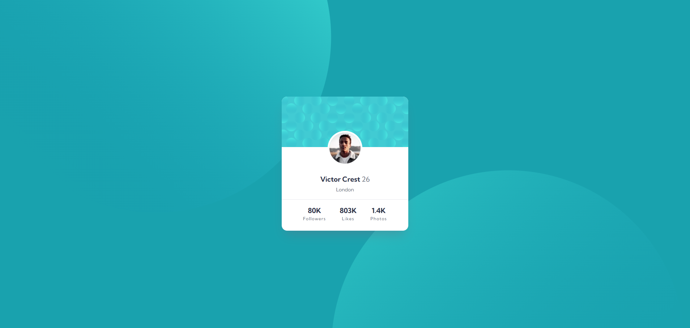

# Frontend Mentor - QR code component solution

This is a solution to the [Profile card component challenge on Frontend Mentor](https://www.frontendmentor.io/challenges/profile-card-component-cfArpWshJ). Frontend Mentor challenges help you improve your coding skills by building realistic projects.

## Table of contents

- [Overview](#overview)
  - [Screenshot](#screenshot)
  - [Links](#links)
  - [Built with](#built-with)
  - [AI Collaboration](#ai-collaboration)
- [Author](#author)

## Overview

This is my solution to the **Profile Card Component** challenge from Frontend Mentor.
The goal of this project was to recreate the provided design as accurately as possible using semantic HTML and CSS, while keeping the layout responsive and visually consistent across different screen sizes.

This challenge was a great opportunity to practice:

- Structuring content with clean and semantic HTML
- Working with CSS for layout, spacing, and alignment
- Positioning decorative background elements
- Building a responsive card component
- Improving attention to detail for pixel-accurate UI implementation

### Screenshot

### Links

- Solution URL: [Repository](https://github.com/joaogllm/frontend-mentor-tests/tree/main/profile-card-component-main)
- Live Site URL: [Live](https://joaogllm.github.io/frontend-mentor-tests/profile-card-component-main/)

### Built with

- Semantic HTML5 markup
- CSS custom properties
- Flexbox
- Mobile-first workflow

### AI Collaboration

- **Tool used:** Claude (Anthropic)
- **How I used it:** I used Claude throughout the challenge as a code reviewer. After writing my HTML and CSS from scratch, I shared my code in multiple rounds and asked for feedback on things I did wrong or could improve.
- **What worked well:** The iterative review process was very effective. Claude caught real bugs (like `min-width` overflowing small screens and a broken avatar positioning approach using `position: absolute` with a conflicting `margin-top`), semantic issues (improving `alt` text and heading levels), and polish details (like using `em` instead of `px` for `letter-spacing`, removing redundant CSS, and fixing the `<head>` link order for better font loading). It also suggested using an `
` with a negative `margin-inline` to handle a divider that needed to break out of a padded container — a clean pattern I'll reuse.
- **What didn't work as well:** One fix (`min-width` → `width: min(...)`) had to be flagged across three review rounds before I applied it, which was on me.

## Author

- Instagram - [Joao Martins](https://www.instagram.com/joaogllm/)
- Frontend Mentor - [@joaogllm](https://www.frontendmentor.io/profile/joaogllm)
- Github - [@joaogllm](https://github.com/joaogllm)
