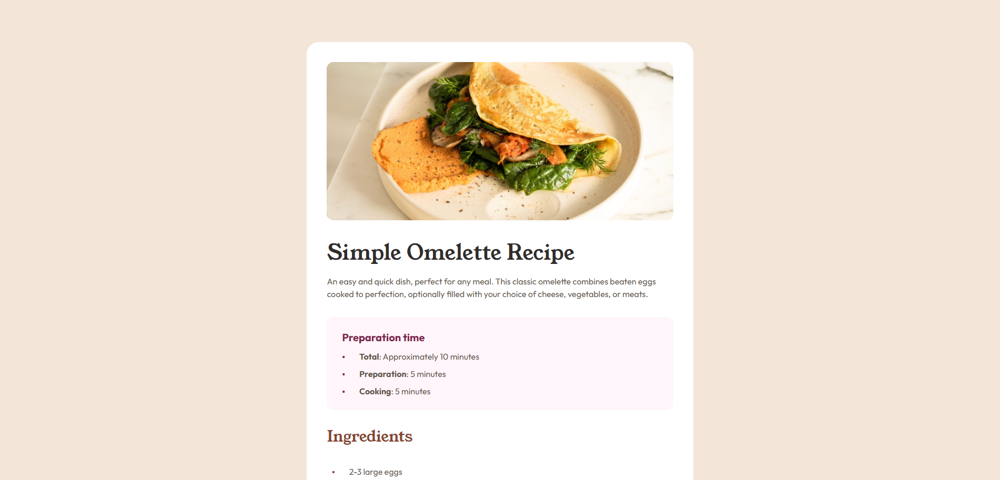

## Table of contents

- [Overview](#overview)
  - [The challenge](#the-challenge)
  - [Screenshot](#screenshot)
  - [Links](#links)
  - [Built with](#built-with)
  - [AI Collaboration](#ai-collaboration)
- [Author](#author)

## Overview

-This is my solution to the Recipe Page challenge from Frontend Mentor. The goal of this project was to build a clean and responsive recipe layout while focusing on semantic HTML, proper spacing, and visual consistency based on the provided design.

### The challenge

Users should be able to:

- View the optimal layout depending on their device's screen size
- See clearly structured content sections (Preparation, Ingredients, Instructions, Nutrition)
- Experience proper typography hierarchy and spacing
- See styled lists and table elements matching the design

### Screenshot

### Links

- Solution URL: [Repository](https://github.com/joaogllm/frontend-mentor-tests/tree/main/recipe-page-main)
- Live Site URL: [Live](https://joaogllm.github.io/frontend-mentor-tests/recipe-page-main/)

### Built with

- Semantic HTML5 markup
- CSS custom properties
- Flexbox
- Mobile-first responsive design
- BEM naming convention

### AI Collaboration

ChatGPT was used as a development assistant during this project to:

- Help structure CSS variables for the design system
- Configure and import local fonts properly
- Improve semantic HTML usage (especially lists and table structure)

## Author

- Instagram - [Joao Martins](https://www.instagram.com/joaogllm/)
- Frontend Mentor - [@joaogllm](https://www.frontendmentor.io/profile/joaogllm)
- Github - [@joaogllm](https://github.com/joaogllm)
