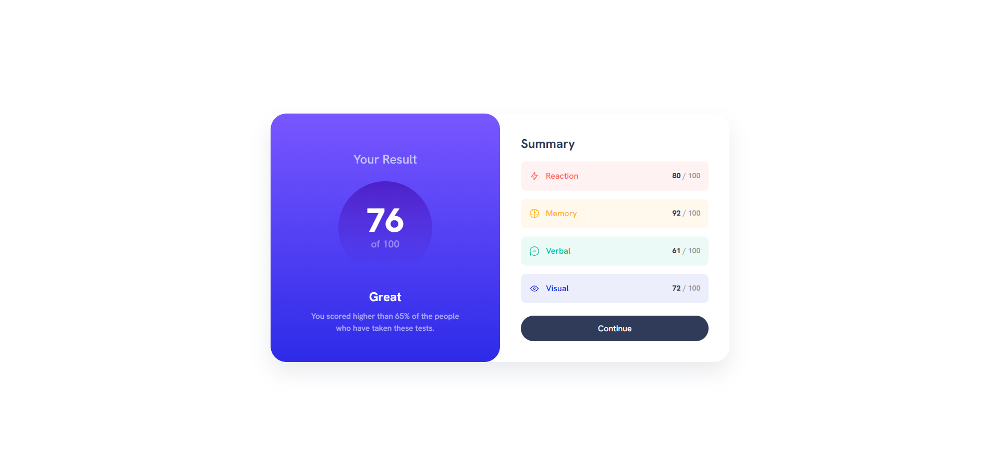

## Table of contents

- [Overview](#overview)
  - [The challenge](#the-challenge)
  - [Screenshot](#screenshot)
  - [Links](#links)
  - [Built with](#built-with)
  - [AI Collaboration](#ai-collaboration)
  - [Author](#author)

## Overview

- This is my solution to the Results Summary Component challenge from Frontend Mentor.
  The goal of this project was to build a responsive results card component based on a provided design, focusing on layout structure, typography, gradients, and reusable CSS variables. The project follows a mobile-first approach and replicates the visual design as closely as possible, including category color styling, gradient backgrounds, and font weight variations using a locally imported typeface. This challenge helped reinforce my understanding of CSS custom properties, layout alignment using Flexbox, and working with design systems extracted from Figma files.

### The challenge

Users should be able to:

- View the optimal layout depending on their device's screen size
- See hover and active states for interactive elements
- Experience a clean and consistent design that matches the provided style guide

### Screenshot

### Links

- Solution URL: [Repository](https://github.com/joaogllm/frontend-mentor-tests/tree/main/results-summary-component-main)
- Live Site URL: [Live](https://joaogllm.github.io/frontend-mentor-tests/results-summary-component-main/)

### Built with

- Semantic HTML5 markup
- CSS custom properties
- Flexbox
- Mobile-first responsive design

### AI Collaboration

During this project, I used AI assistance as a learning and productivity tool.

AI helped me:

- Structure and refine CSS custom properties
- Create scalable and semantic color variable naming conventions
- Implement vertical linear gradients correctly
- Import and configure a local variable font using @font-face
- Understand font weights such as Medium (500) and ExtraBold (800)

All layout decisions, structure, and implementation were developed and coded by me. AI was used strictly as a support tool to clarify concepts, improve best practices, and accelerate learning — not as a replacement for understanding.

This collaboration allowed me to write cleaner, more maintainable CSS and better document my work.

## Author

- Instagram - [Joao Martins](https://www.instagram.com/joaogllm/)
- Frontend Mentor - [@joaogllm](https://www.frontendmentor.io/profile/joaogllm)
- Github - [@joaogllm](https://github.com/joaogllm)
