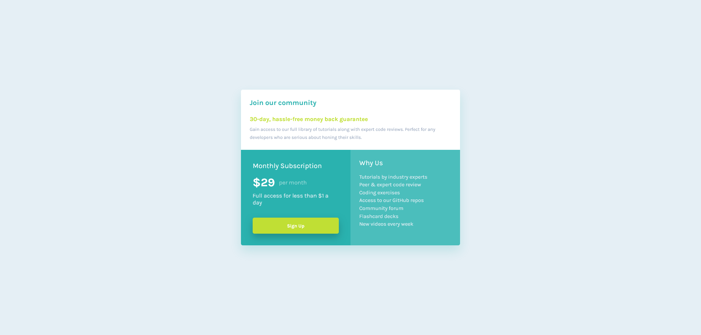

# Frontend Mentor - Single Price Grid Component

## Table of contents

- [Overview](#overview)
  - [The challenge](#the-challenge)
  - [Screenshot](#screenshot)
  - [Links](#links)
  - [Built with](#built-with)
  - [AI Collaboration](#ai-collaboration)
  - [Author](#author)

## Overview

This is a solution to the [Single Price Grid Component challenge on Frontend Mentor](https://www.frontendmentor.io/challenges/single-price-grid-component-5ce41129d0ff452fec5abbbc). The goal was to build a responsive pricing card that closely matches the provided design, transitioning from a single-column stacked layout on mobile to a two-column CSS Grid layout on desktop.

### The challenge

Users should be able to:

- View the optimal layout for the component depending on their device's screen size
- See a hover state on the Sign Up button

### Screenshot

### Links

- Solution URL: [Repository](https://github.com/joaogllm/frontend-mentor-tests/tree/main/single-price-grid-component-master)
- Live Site URL: [Live](https://joaogllm.github.io/frontend-mentor-tests/single-price-grid-component-master/)

### Built with

- Semantic HTML5
- CSS custom properties
- CSS Grid
- Mobile-first workflow
- [Karla](https://fonts.google.com/specimen/Karla) - Google Font

### AI Collaboration

This project was developed with the assistance of [Claude](https://claude.ai) (Anthropic). AI was used to:

- Generate the base CSS reset and color custom properties from the style guide
- Help debug a layout issue caused by `grid-template-rows: repeat(2, 1fr)` creating unwanted white space
- Suggest `box-shadow` values for the card and the Sign Up button, which are not specified in the official style guide

All code was reviewed, understood, and integrated manually.

## Author

- Instagram - [Joao Martins](https://www.instagram.com/joaogllm/)
- Frontend Mentor - [@joaogllm](https://www.frontendmentor.io/profile/joaogllm)
- Github - [@joaogllm](https://github.com/joaogllm)
