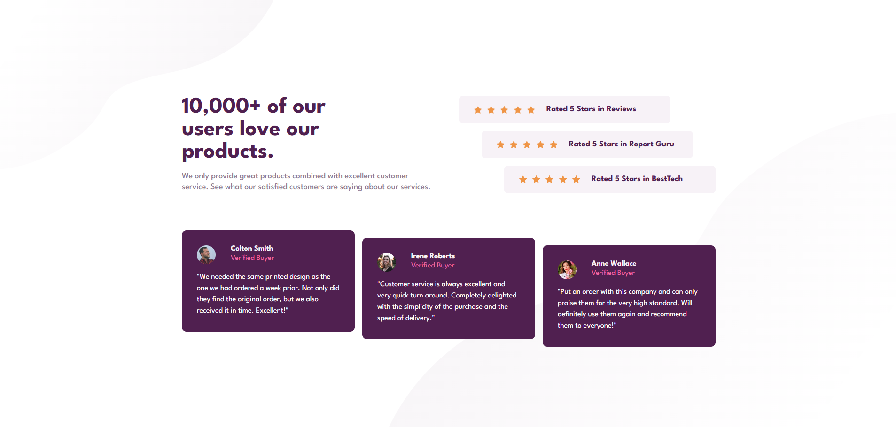

## Table of contents

- [Overview](#overview)
  - [The challenge](#the-challenge)
  - [Screenshot](#screenshot)
  - [Links](#links)
  - [Built with](#built-with)
  - [AI Collaboration](#ai-collaboration)
  - [Author](#author)

## Overview

This is a solution to the [Social Proof Section challenge on Frontend Mentor](https://www.frontendmentor.io/challenges/social-proof-section-6e0qTv_bA). The goal was to build a responsive social proof section that closely matches the provided design, featuring a staggered rating layout and testimonial cards that adapt from a stacked mobile view to a side-by-side desktop layout.

### The challenge

Users should be able to:

- View the optimal layout for the section depending on their device's screen size
- See the staggered rating bars and testimonial cards on desktop

### Screenshot

### Links

- Solution URL: [Repository](https://github.com/joaogllm/frontend-mentor-tests/tree/main/social-proof-section-master)
- Live Site URL: [Live](https://joaogllm.github.io/frontend-mentor-tests/social-proof-section-master/)

### Built with

- Semantic HTML5 markup (BEM naming convention)
- CSS custom properties
- Flexbox
- CSS Grid
- Mobile-first workflow

### AI Collaboration

This challenge was completed with the assistance of Claude (Anthropic) as a learning tool. AI was used to:

- Review HTML semantics and accessibility (ARIA labels, `<figure>`, `<blockquote>`, `role="list"`)
- Refine BEM class naming conventions
- Debug layout issues such as the staggered ratings clipping on narrow desktop viewports
- Guide the construction of the desktop media query

All code was written and understood by me — AI served as a reviewer and mentor, not a code generator.

## Author

- Instagram - [Joao Martins](https://www.instagram.com/joaogllm/)
- Frontend Mentor - [@joaogllm](https://www.frontendmentor.io/profile/joaogllm)
- Github - [@joaogllm](https://github.com/joaogllm)
